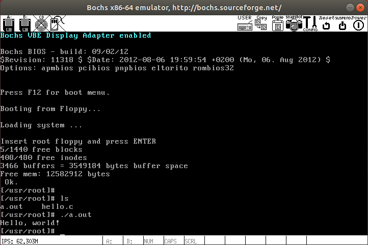

# 工具

工具主要指os运行的虚拟机。我们当然可以将编译好的二进制写入软盘或硬盘中，然后用真机去运行。但这样测试太麻烦了，如果想看寄存器或内存内容更麻烦。相比之下，使用虚拟机就方便很多。

虚拟机软件很多，商用的比如VMware、VirtualBox等功能都很强大。这里我们介绍**bochs**和**qemu**，当然你也可以使用其它的。

## bochs

使用bochs可以方便的进行调试，比如打断点单步执行，查看寄存器、内存内容等。

使用如下命令在ubuntu中安装bochs。

```bash
sudo apt install vgabios bochs bochs-x bximage
```

### bochs 启动

bochs启动时依赖```bochsrc```配置文件, bochsrc中会指明虚拟机内存，启动磁盘等情况。在配置文件所在目录执行```bochs```即可根据配置文件内容启动虚拟机。

## qemu

qemu不仅可以模拟x86，也可以模拟arm等其它指令集CPU。很多软件都集成qemu来进行模拟其它设备，比如windows下的docker现在支持运行arm容器，背后就是使用qemu；再比如android开发中用到的android模拟器，也是使用了qemu。

### qemu启动

安装好qemu之后，一般会有多个```qemu```为前缀的多个二进制文件，不同的后缀代表不同的指令集，比如```qemu-system-aarch64```。我们在x86下开发，使用如下命令进行：

```bash
qemu-system-x86_64 -fda a.img
```

## linux 0.11

### 下载镜像

从[OldLinux](http://www.oldlinux.org/)可以下载到历史版本的Linux内核镜像。

- [bootimage](http://www.oldlinux.org/Linux.old/images/bootimage-0.11-20040305)
- [rootimage](http://www.oldlinux.org/Linux.old/images/rootimage-0.11-20040305)

### 启动

使用如下bochs配置文件启动bochs虚拟机运行Linux 0.11版本镜像：

```txt
megs: 32
romimage: file=/usr/share/bochs/BIOS-bochs-latest
vgaromimage: file=/usr/share/vgabios/vgabios.bin
floppya: 1_44="bootimage-0.11", status=inserted
floppyb: 1_44="rootimage-0.11", status=inserted
boot: a
log: bochsout.txt
```

### 更换软盘

启动之后会显示 *Insert root floppy and press ENTER*， 这是需要将```rootimage```更换到软盘A上。点击右上角```CONFIG```进行设置。Linux下bochs设置是在命令行进行的。输入```1```，将软盘A更换为```rootimage-0.11```，然后使用默认配置即可。更换完成后选择```13```继续进行模拟。

```txt
---------------------
Bochs Runtime Options
---------------------
1. Floppy disk 0: bootimage-0.11, size=1.44M, inserted
2. Floppy disk 1: rootimage-0.11, size=1.44M, inserted
3. 1st CDROM: (not present)
4. 2nd CDROM: (not present)
5. 3rd CDROM: (not present)
6. 4th CDROM: (not present)
7. (not implemented)
8. Log options for all devices
9. Log options for individual devices
10. Instruction tracing: off (doesn't exist yet)
11. USB runtime options
12. Misc runtime options
13. Continue simulation
14. Quit now

Please choose one:  [13] 1

------------------
First Floppy Drive
------------------

Enter new filename, or 'none' for no disk: [bootimage-0.11] rootimage-0.11

What type of floppy media? (auto=detect) [1.44M]

Is media write protected? [no]

Is media inserted in drive? [yes]
---------------------
Bochs Runtime Options
---------------------
1. Floppy disk 0: rootimage-0.11, size=1.44M, inserted
2. Floppy disk 1: rootimage-0.11, size=1.44M, inserted
3. 1st CDROM: (not present)
4. 2nd CDROM: (not present)
5. 3rd CDROM: (not present)
6. 4th CDROM: (not present)
7. (not implemented)
8. Log options for all devices
9. Log options for individual devices
10. Instruction tracing: off (doesn't exist yet)
11. USB runtime options
12. Misc runtime options
13. Continue simulation
14. Quit now

Please choose one:  [13]
Continuing simulation
```

更换完软盘后，按照屏幕提示，在bochs中输入```ENTER```即可进入文件系统。最终效果如下图所示。


