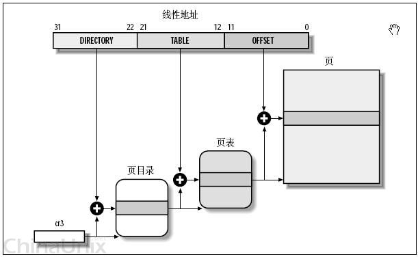

# 分页机制

页目录表PDE(page directory entry)

页表PTE(page table entry)

## 逻辑地址 -> 线性地址

- 分页单元中，页目录是唯一的，它的地址放在CPU的cr3寄存器中，是进行地址转换的开始点。万里长征就从此长始了。
- 每一个活动的进程，因为都有其独立的对应的虚似内存（页目录也是唯一的），那么它也对应了一个独立的页目录地址。——运行一个进程，需要将它的页目录地址放到cr3寄存器中，将别个的保存下来。
- 每一个32位的线性地址被划分为三部份，面目录索引(10位)：页表索引(10位)：偏移(12位)

依据以下步骤进行转换：

- 从cr3中取出进程的页目录地址（操作系统负责在调度进程的时候，把这个地址装入对应寄存器）；
- 根据线性地址前十位，在数组中，找到对应的索引项，因为引入了二级管理模式，页目录中的项，不再是页的地址，而是一个页表的地址。（又引入了一个数组），页的地址被放到页表中去了。
- 根据线性地址的中间十位，在页表（也是数组）中找到页的起始地址；
- 将页的起始地址与线性地址中最后12位相加，得到最终我们想要的葫芦

## Linux的分页机制

