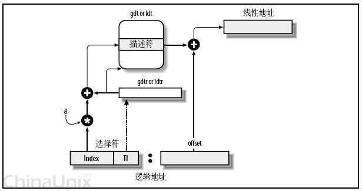
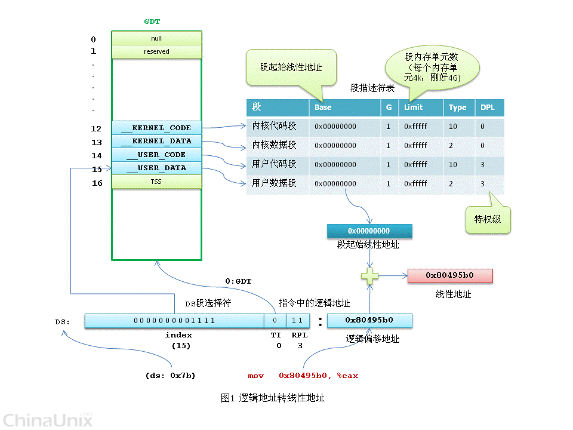

# 分段机制

为了支持分段机制，x86 CPU提供了```GDTR```、```LDTR```寄存器，```LGDT```等指令。

## 逻辑地址

[段标识符:段内偏移量]

段标识符（段选择符）对应CS等段寄存器值，长度16位。在保护模式下，段选择符各位意义如下：

<table style="font-size:10px;text-align:center">
<thead>
<tr>
<th style="background-color:#ccc">15</th><th>14</th>
<th style="background-color:#ccc">13</th><th>12</th>
<th style="background-color:#ccc">11</th><th>10</th>
<th style="background-color:#ccc">9</th><th>8</th>
<th style="background-color:#ccc">7</th><th>6</th>
<th style="background-color:#ccc">5</th><th>4</th>
<th style="background-color:#ccc">3</th><th>2</th>
<th style="background-color:#ccc">1</th><th>0</th>
</tr>
</thead>
<tr>
<td colspan="13">索引号</td>
<td style="background-color:#ccc">TI</td>
<td colspan="2">RPL</td>
</tr>
</table>

段选择符中的13位索引号，表示```段描述符表```中的索引。

## 段描述符

```段描述符表(segment descriptor table)```是由```段描述符(segment descriptor)```组成的数组，段选择符(selector)中的索引号指向具体某一个段描述符。

段描述符有64 bit，内容看着有点儿别扭。比如```BASE```占32 bit, 但这32 bit分为3部分，三部分拼在一起表示```BASE```字段。具体如下图示例：

<table style="font-size:10px;text-align:center;border:1px">
<thead>
<tr>
<th style="background-color:#ccc">62</th><th>62</th>
<th style="background-color:#ccc">61</th><th>60</th>
<th style="background-color:#ccc">59</th><th>58</th>
<th style="background-color:#ccc">57</th><th>56</th>
<th style="background-color:#ccc">55</th><th>54</th>
<th style="background-color:#ccc">53</th><th>52</th>
<th style="background-color:#ccc">51</th><th>50</th>
<th style="background-color:#ccc">49</th><th>48</th>
<th style="background-color:#ccc">47</th><th>46</th>
<th style="background-color:#ccc">45</th><th>44</th>
<th style="background-color:#ccc">43</th><th>42</th>
<th style="background-color:#ccc">41</th><th>40</th>
<th style="background-color:#ccc">39</th><th>38</th>
<th style="background-color:#ccc">37</th><th>36</th>
<th style="background-color:#ccc">35</th><th>34</th>
<th style="background-color:#ccc">33</th><th>32</th>
</tr>
</thead>
<tr>
<td colspan="8">BASE(24-31)</td>
<td style="background-color:#ccc">G</td>
<td>D</td>
<td style="background-color:#ccc">O</td>
<td>AVL</td>
<td style="background-color:#ccc" colspan="4">LIMIT(16-19)</td>
<td>1</td>
<td>DPL</td>
<td style="background-color:#ccc">S=1</td>
<td colspan="4">TYPE</td>
<td colspan="8">BASE(16-23)</td>
</tr>
<tr>
<td colspan="16">BASE(0-15)</td>
<td colspan="16">LIMIT(0-15)</td>
</tr>
<tr>
<th style="background-color:#ccc">31</th><th>30</th>
<th style="background-color:#ccc">29</th><th>28</th>
<th style="background-color:#ccc">27</th><th>26</th>
<th style="background-color:#ccc">25</th><th>24</th>
<th style="background-color:#ccc">23</th><th>22</th>
<th style="background-color:#ccc">21</th><th>20</th>
<th style="background-color:#ccc">19</th><th>18</th>
<th style="background-color:#ccc">17</th><th>16</th>
<th style="background-color:#ccc">15</th><th>14</th>
<th style="background-color:#ccc">13</th><th>12</th>
<th style="background-color:#ccc">11</th><th>10</th>
<th style="background-color:#ccc">9</th><th>8</th>
<th style="background-color:#ccc">7</th><th>6</th>
<th style="background-color:#ccc">5</th><th>4</th>
<th style="background-color:#ccc">3</th><th>2</th>
<th style="background-color:#ccc">1</th><th>0</th>
</tr>
</table>

BASE字段表示一个段起始位置的线性地址。

## GDT & LDT

全局描述符表(GDT, global descriptor table)和局部描述符表(LDT, local descriptor table)。Intel设计的本意是，一些全局的段描述符，就放在“全局段描述符表(GDT)”中，一些局部的，例如每个进程自己的，就放在所谓的“局部段描述符表(LDT)”中。那究竟什么时候该用GDT，什么时候该用LDT呢？这是由段选择符中的T1字段表示的，TI=0，表示用GDT，TI=1表示用LDT。

GDT在内存中的地址和大小存放在CPU的gdtr控制寄存器中，而LDT则在ldtr寄存器中。

<table style="font-size:10px;text-align:center">
<tr>
<td style="background-color:#ccc">47</td><td>46</td>
<td style="background-color:#ccc">45</td><td>44</td>
<td style="background-color:#ccc">43</td><td>42</td>
<td style="background-color:#ccc">41</td><td >40</td>
<td style="background-color:#ccc">39</td><td>38</td>
<td style="background-color:#ccc">37</td><td>36</td>
<td style="background-color:#ccc">35</td><td>34</td>
<td style="background-color:#ccc">33</td><td>32</td>
<td style="background-color:#ccc">31</td><td>30</td>
<td style="background-color:#ccc">29</td><td>28</td>
<td style="background-color:#ccc">27</td><td>26</td>
<td style="background-color:#ccc">25</td><td>24</td>
<td style="background-color:#ccc">23</td><td>22</td>
<td style="background-color:#ccc">21</td><td>20</td>
<td style="background-color:#ccc">19</td><td>18</td>
<td style="background-color:#ccc">17</td><td>16</td>
<td style="background-color:#ccc">15</td><td>14</td>
<td style="background-color:#ccc">13</td><td>12</td>
<td style="background-color:#ccc">11</td><td>10</td>
<td style="background-color:#ccc">9</td><td>8</td>
<td style="background-color:#ccc">7</td><td>6</td>
<td style="background-color:#ccc">5</td><td>4</td>
<td style="background-color:#ccc">3</td><td>2</td>
<td style="background-color:#ccc">1</td><td>0</td>
</tr>
<tr>
<td colspan="32" style="background-color:#ccc">32位基地址</td>
<td colspan="16">16位界限</td>
</tr>
</table>

## 逻辑地址 -> 线性地址



首先，给定一个完整的逻辑地址[段选择符：段内偏移地址]，

- 看段选择符的T1=0还是1，知道当前要转换是GDT中的段，还是LDT中的段，再根据相应寄存器，得到其地址和大小。我们就有了一个数组了。

- 拿出段选择符中前13位，可以在这个数组中，查找到对应的段描述符，这样，它了Base，即基地址就知道了。

- 把Base + offset，就是要转换的线性地址了。

寻址过程由CPU硬件自动完成。

## Linux的分段机制

按照Intel的本意，全局的用GDT，每个进程自己的用LDT。但Linux中只使用GDT，所有进程使用相同的段对指令和数据进行寻址，即用户代码段，用户数据段。

并且Linux中，GDT中所有描述符的```BASE```字段均为0。因此，Linux下，逻辑地址与线性地址总是一致的。


